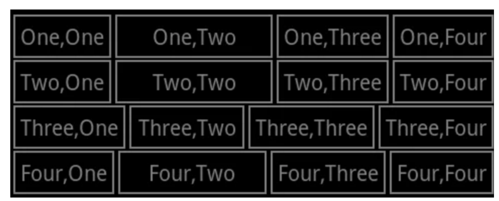
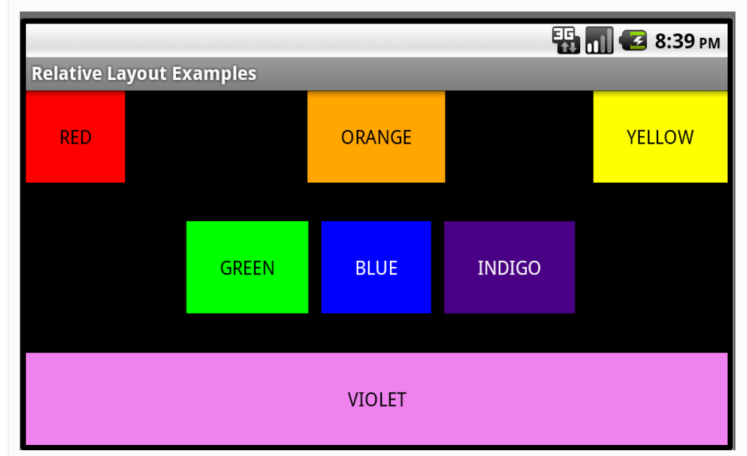
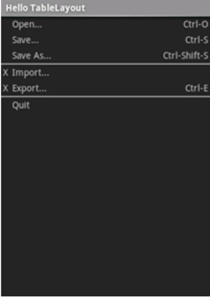
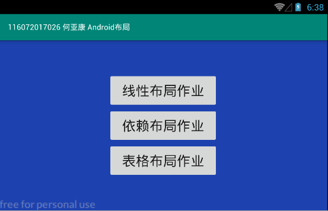
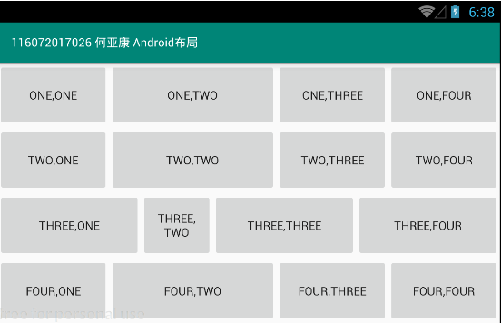
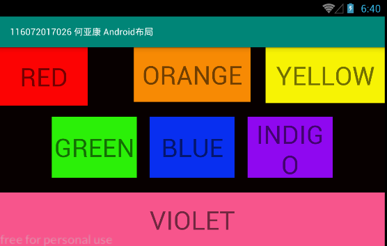
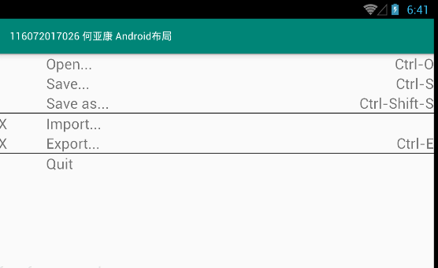

# Android实验

## 学院：数信学院                     班级：17软闽

## 学号：116072017026          姓名：何亚康    

## Hello 给你感受一下我做完了实验1和2

学习官方文档：
https://developer.android.google.cn/guide/topics/ui/declaring-layout.html
 学习文档中关于ConstraintLayout, LinearLayout和TableLayout的相关内容

实验1就不用展示吧 soeasy

### 1.利用线性布局实现如下界面：  

### 2.利用ConstraintLayout实现如下界面：  

### 3.利用表格布局实现如下界面：  

## 实现效果

### 主界面：

### 1.利用线性布局实现如下界面：  

### 2.利用ConstraintLayout实现如下界面：  

### 3.利用表格布局实现如下界面：  

