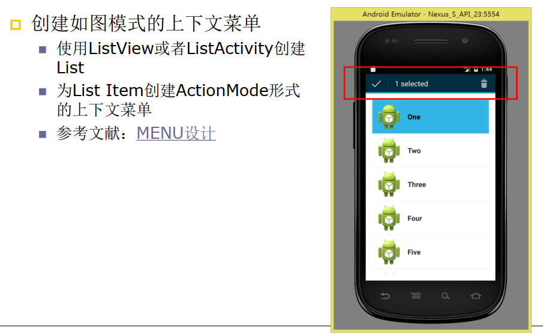

# Android实验

## 学院：数信学院                     班级：17软闽

## 学号：116072017026          姓名：何亚康    

## Android——UI实验  

学习官方文档：
https://developer.android.google.cn/guide/topics/ui/declaring-layout.html
 学习文档中关于ConstraintLayout, LinearLayout和TableLayout的相关内容


### 1.Android ListView的用法   


### 2.创建自定义布局的AlertDialog   


### 3.使用XML定义菜单   


### 4.创建上下文操作模式(ActionMode)的上下文菜单  




自学内容
 学习Android RecyclerView
◼ 指南：
https://developer.android.google.cn/guide/topics/ui/layo
ut/recyclerview.html
◼ Sample： https://github.com/android/views-widgetssamples
 Card-Based Layout
◼ 指南：
https://developer.android.google.cn/guide/topics/ui/layo
ut/cardview.html#AddDependency  


# 作业效果

### 1.Android ListView的用法   

#### 关键代码

``

```java
private String[] names = new String[]
        {"Lion","Tiger","Monkey","Dog","Cat","Elephant"};
private int[] ImageIds = new int[]{R.drawable.lion,R.drawable.tiger,
        R.drawable.monkey, R.drawable.dog,R.drawable.cat,R.drawable.elephant};
@Override
protected void onCreate(Bundle savedInstanceState) {
    super.onCreate(savedInstanceState);
    setContentView(R.layout.activity_main);
    List<Map<String,Object>> listItems = new ArrayList<>();
    for (int i=0;i<names.length;i++)
    {
        Map<String, Object> listItem = new HashMap<>();
        listItem.put("Name",names[i]);
        listItem.put("Header",ImageIds[i]);
        listItems.add(listItem);
    }
    SimpleAdapter simpleAdapter = new SimpleAdapter(this,listItems,R.layout.simple_item,
            new String[]{"Name","Header"},new int[]{R.id.name,R.id.header});
    ListView list = findViewById(R.id.mylist);
    list.setAdapter(simpleAdapter);

    list.setOnItemClickListener(new AdapterView.OnItemClickListener()
    {
        @Override
        public void onItemClick(AdapterView<?> parent, View view, int position, long id) {
            System.out.println(names[position] + "被单击了.........");
        }
    });

    list.setOnItemSelectedListener(new AdapterView.OnItemSelectedListener()
    {
        @Override
        public void onItemSelected(AdapterView<?> parent, View view, int position, long id)
        {
            Toast toast = Toast.makeText(MainActivity.this, names[position], Toast.LENGTH_SHORT);
            toast.show();
        }
        @Override
      public void onNothingSelected(AdapterView<?> parent)
        {
			Toast toast = Toast.makeText(MainActivity.this, names[position], Toast.LENGTH_SHORT);
            toast.show();
         }
   });
```


### 2.创建自定义布局的AlertDialog   

#### 关键代码

```java
new AlertDialog.Builder(this)
        .setView(login)
        .setPositiveButton("Sign in", (dialog, which) -> {show.setText("单击了登入按钮！");
        })
        .setNegativeButton("Cancel", (dialog, which) -> {show.setText("单击了取消按钮！");
        })
        .create().show();
```


### 3.使用XML定义菜单   


### 4.创建上下文操作模式(ActionMode)的上下文菜单  


