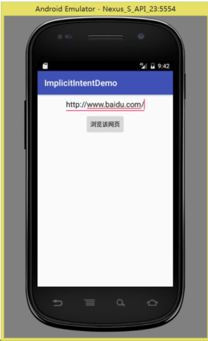
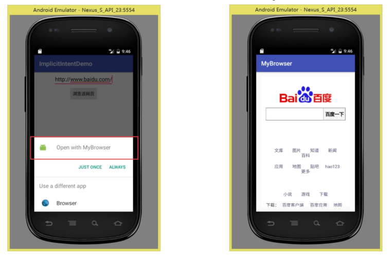
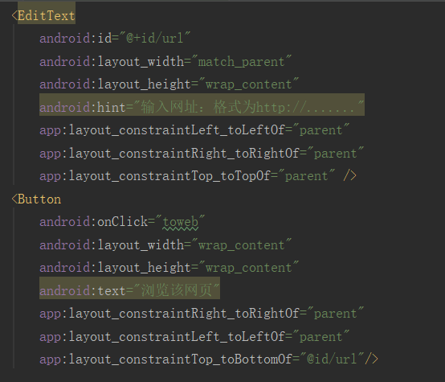
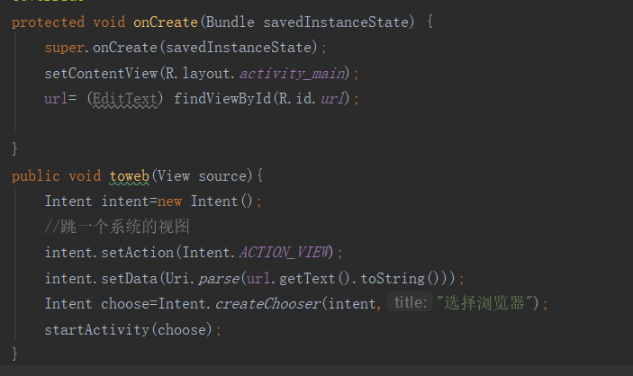
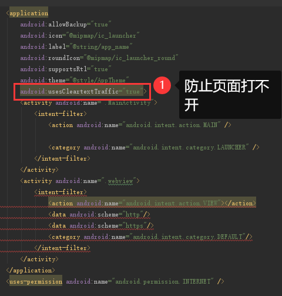
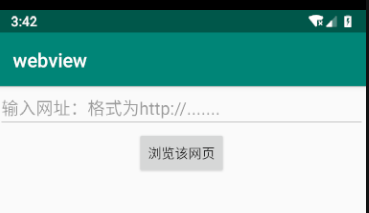
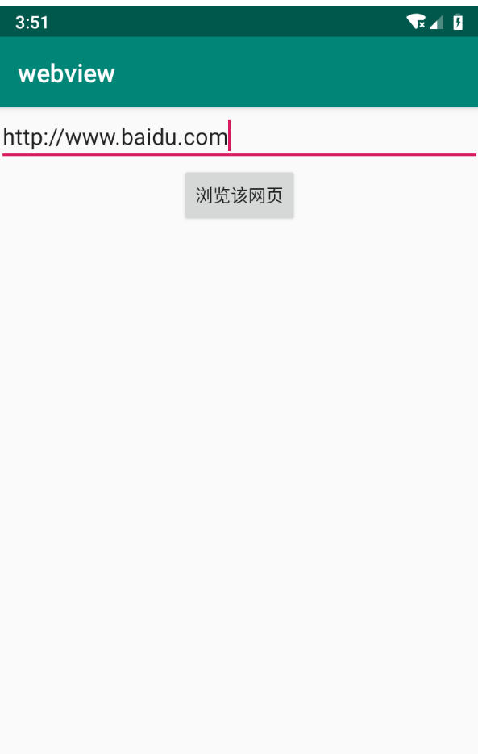
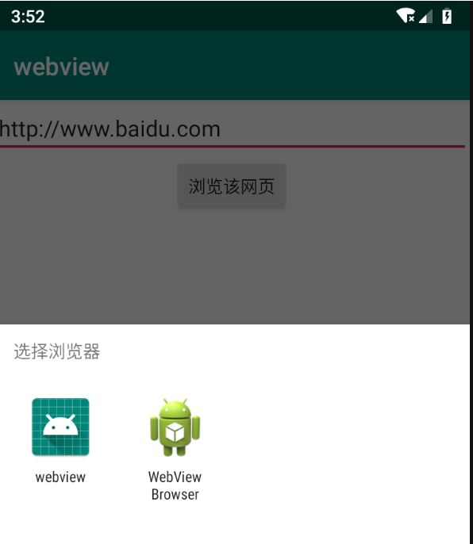

# Android实验

## 学院：数信学院                     班级：17软闽

## 学号：116072017026          姓名：何亚康    

## 自定义WebView验证隐式Intent的使用  

学习官方文档：
https://developer.android.google.cn/guide/topics/ui/declaring-layout.html
 学习文档中关于ConstraintLayout, LinearLayout和TableLayout的相关内容

## 实验内容

本实验通过自定义WebView加载URL来验证隐式Intent
的使用。
 实验包含两个应用：
◼ 第一个应用：获取URL地址并启动隐式Intent的调用。
◼ 第二个应用：自定义WebView来加载URL  

新建一个工程用来获取URL地址并启动Intent
输入URL网址，点击按钮，将发起浏览网页的行为  

新建一个工程使用WebView来加载URL
跳转之后，出现选择项，选择自定义的MyBrowser进行浏览  

# 实验结果

## 1.获取URL地址并启动隐式Intent的调用。

### 布局文件：添加一个edittext框用来填写网址，并提示用户输入的格式为http://...

### 用url来存放从edittext获取到的网址，并用intent打开

### AndroidManifest.xml配置文件

### 编辑intent工程

### 先输入网址，然后选择服务器（ http://ww.baidu.com)

### 点击游览该网页后，选择web游览器

### 可以用web查看网页了

## 参考文献

 https://developer.android.google.cn/guide/compo
nents/intents-filters  